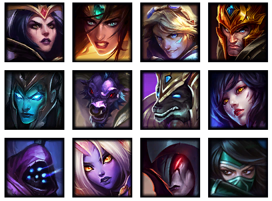

# Lol Memory Game

[Play Me Now](https://lol-memory-challenge.herokuapp.com/)
In this react app I've built a memory game rendering 12 images for you to try to remember which ones you've clicked.
The challenge is that everytime you click an image the images are shuffled and rendered back to DOM.
Since this is a react app this is a seemless transition of dynamic content with no page refresh through gameplay.

## Index
[Developer Section](#Developer-Section)

## Developer-Section

### Technologies Used

In this app we're utilizing the abundant technology of `react.js` by utilizing the npm `create-react-app`.
This builds a bootstrapped framework for the app allowing creation of components to develop the app.

#### ReactStrap

npm `reactstrap` allows for quick integration of bootstrap technologies while developing your react components.
I utilized this to create the UI for the app.

#### Fisher Yates Shuffle

Part of the challenge was shuffling the images and rendering them to the page.
I did a quick google search on javascrip array shuffle and found this great function.
This allows for fast shuffling of arrays utilizing a minimum ammount of memory in order to execute the task. 

## Educational

If you're wanting to use this repo for educational purposes you'll need the following:
`node` -> `mkdir sandbox` -> `cd sandbox` -> `npm install yarn create-react-app reactstrap` -> `node create-react-app yourappname`;
Once you've done this you can copy over the components or write your own to create your own app.

If you want to utilize all the code here then clone the repo into node `git clone` and paste the link.
you'll still need to `npm install` then you can `yarn start` or `npm start` depending on your preferences and global settings. 

## I'm Deployed

Come play the game [here](https://lol-memory-challenge.herokuapp.com/)